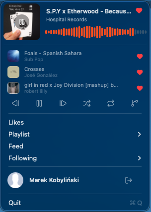

# Reed 🌱

A tiny **native macOS menu‑bar player for SoundCloud**. Press the icon, and your
likes, playlists, feed, and the people you follow are one click away — playing
instantly, with native Now Playing and media‑key support. No browser tab, no
heavy website, no dock icon.

> **One‑sentence pitch:** SoundCloud, reduced to a personal music launcher that
> lives in your menu bar.
>
> *(Named for the reed — the slender stalk that vibrates to make sound, and looks
> just like the waveform in the icon.)*

<p align="center">
  
</p>

---

## Why

> A few times I've come back to the idea of a SoundCloud player. I was looking
> for something small and tucked away that just plays my likes during coding
> sessions — and sometimes goes a little beyond them, using recommendations to
> find something new. Minimum UI. No extra window, no browser tab. Mac‑native.
> That small thing makes me happy.

If you use SoundCloud mainly as a **music library** — likes, playlists, the feed,
artists you follow — the website is a lot: a feed, comments, reposts, uploads, a
whole social layer, and a browser tab that has to stay open.

Reed throws all of that away and keeps the one thing that matters for listening:
**press a shortcut, pick a source, music starts.** It's built for people who
already know what they want to hear and want it in the background — with a
**radio** button for when you want to drift past your likes into something new.

It's a real native app (Swift + AppKit + AVFoundation), so it gets the things a
browser can't: **media keys, the macOS Now Playing widget, gapless crossfade,**
and a menu‑bar presence that's always one click away.

---

## Features

**Playback**
- 🎚 **Mini‑player** in the menu: artwork, title/artist, and a SoundCloud‑style
  **waveform progress bar** — click anywhere on it to seek.
- ⏯ Play / pause overlaid on the poster (on hover), plus a full transport
  toolbar: **prev · play/pause · next · shuffle · repeat · radio**.
- 🕘 **Recently‑played** rows (last 3) — click to jump back; like each from there.
- 🎧 **DJ mode** — equal‑power **crossfade** between tracks (on by default).
- 🔁 **Repeat‑one** — loop the current track.
- 🔀 **Shuffle** the upcoming queue.
- 📻 **Radio** — start an endless **related‑tracks station** from the current song.
- ❤️ **Like / unlike** any track inline.

**Sources**
- **Likes** — your whole likes library (paginated, hundreds of tracks).
- **Playlists** — a searchable‑by‑typing, scrollable submenu.
- **Feed** — your stream.
- **Following** — a scrollable list of everyone you follow → play any user's likes.

**Native integration**
- 🎵 **Now Playing** (Control Center / lock screen) + **hardware media keys**.
- 🔊 Streams SoundCloud's **HLS AAC** via `AVPlayer`.
- 💾 Remembers your last queue and reopens where you left off.
- 🌙 Custom **Lucide** line icons that adapt to light/dark menus.
- 🔐 Sign in with your SoundCloud account (OAuth 2.1 + PKCE); your avatar,
  username, and a logout live at the bottom of the menu.

---

## ⚠️ SoundCloud API access requires **Artist Pro**

This is the one prerequisite worth knowing up front.

SoundCloud closed public API registration for years, then **reopened it in June
2026** via a CLI tool (`sc-api-auth.mjs`). Getting your own API credentials
(`client_id` / `client_secret`) now requires a **paid Artist Pro subscription**
(SoundCloud's creator plan — also branded "Next Pro" / "Pro" over the years).

- A **free artist profile is not enough** — app registration (`POST /me/apps`)
  returns *"Application registration is not available for your account"* without
  the paid plan.
- Verify/activate at **[soundcloud.com/pro](https://soundcloud.com/pro)**.

Without Artist Pro you can't connect an account, so there's nothing for Reed to
play — the subscription is effectively required to use it.

---

## Requirements

- **macOS 13+**
- **Swift 6** toolchain — full Xcode *or* just the **Command Line Tools**
  (`xcode-select --install`). No Xcode project needed; it builds with SwiftPM.
- **SoundCloud Artist Pro** — only to use your real account (see above).
- **Node 18+** — *optional*, only if you use the command‑line credential fallback
  instead of the in‑app **Connect** flow.

---

## Install

### Option A — Homebrew (recommended)

```sh
brew install --cask kobylinski/tap/reed
```

Reed is currently **ad‑hoc signed** (Developer ID notarization is on the way), so
on first launch macOS shows a Gatekeeper prompt once — **right‑click Reed in
Applications → Open → Open**. After that it launches normally.

(Or grab `Reed.zip` straight from the [latest release](../../releases/latest).)

### Option B — build from source

```sh
git clone https://github.com/<you>/reed
cd reed
./scripts/bundle.sh          # SwiftPM build + assembles Reed.app
open ./Reed.app
```

`bundle.sh` compiles the SwiftPM executable and wraps it in a real `.app` bundle
(with `Info.plist`, the `reed://` URL scheme, and an ad‑hoc
signature) — required for media keys, Now Playing, and the OAuth callback.

On first launch the menu just shows **Connect SoundCloud…** — sign in below.

---

## Sign in (use your SoundCloud account)

The whole credential setup is now in the app — **no Node, no editing JSON.**

1. **Menu → "Connect SoundCloud…"** → sign in in the browser. The app registers
   itself on your account and saves the credentials for you.
2. It then opens your [SoundCloud apps page](https://soundcloud.com/you/apps) and
   copies `reed://callback` to your clipboard. Open your app there,
   **paste it into Redirect URI, and Save** — this one step is manual because
   SoundCloud's API won't let an app set its own redirect.
3. **Menu → "Log in to SoundCloud…"** → approve. Done.

Your token lives at `~/Library/Application Support/reed/tokens.json`
and refreshes automatically, so you stay signed in across restarts.

> Prefer the command line? You can still run SoundCloud's
> [`sc-api-auth.mjs`](https://github.com/soundcloud/api/tree/master/scripts) and
> drop the credentials into `~/.config/reed/credentials.json` (see
> `credentials.sample.json`).

---

## How it works

- **SwiftPM executable → `.app` bundle.** No `.xcodeproj`; `scripts/bundle.sh`
  assembles the bundle so accessory‑app, media‑key, Now Playing, and custom‑URL
  behaviors work.
- **OAuth 2.1 + PKCE** against `secure.soundcloud.com`, with a **custom‑scheme
  callback** (`reed://callback`) handled via the app's URL‑scheme
  registration — no loopback server.
- **Playback engine** uses two `AVPlayer`s so DJ mode can crossfade; streams are
  resolved per track from `/tracks/{urn}/streams` (HLS AAC) just before play.
- **The whole UI is a single self‑refreshing menu panel** (mini‑player + history
  + toolbar) that updates live while the menu is open, with a fixed height so an
  `NSMenu` can host it.
- **Icons** are Lucide SVGs rendered to template images by a small built‑in
  SVG‑path renderer (`LucideIcons.swift`).
- A clean `SoundCloudAPI` protocol seam keeps the UI decoupled from the **live**
  OAuth‑backed client (and a no‑op stand‑in while disconnected).

### Project layout

```
Sources/Reed/
├── main.swift, AppDelegate.swift     # entry + menu wiring
├── PlaybackEngine.swift              # dual-AVPlayer queue, crossfade, Now Playing
├── Track.swift, Playlist.swift, QueueStore.swift
├── Auth/                             # PKCE, credentials, token store, OAuth flow
├── API/                             # DTOs + LiveSoundCloudAPI
└── UI/                              # mini-player, panel, toolbar, lists, icons
scripts/bundle.sh                     # build + assemble the .app
credentials.sample.json
```

---

## Not included / known limits

- **No Stations.** SoundCloud's saved stations are *liked system‑playlists* that
  live only in the internal `api-v2`, which rejects official API tokens — so
  they can't be reached without a separate, fragile web‑session login. Out of
  scope. (The **radio** button gives you an equivalent endless station from any
  track.)
- **Listening only** — no uploads, comments, reposts, messaging, or the social
  feed beyond playing it.
- **DJ mode is volume crossfade**, not beat‑matched mixing.
- Distribution would need a real signing identity (full Xcode); the dev build is
  ad‑hoc signed.

---

## License

MIT — see [LICENSE](LICENSE).

Not affiliated with SoundCloud. Uses SoundCloud's official public API under its
[API Terms of Use](https://developers.soundcloud.com/docs/api/terms-of-use).
